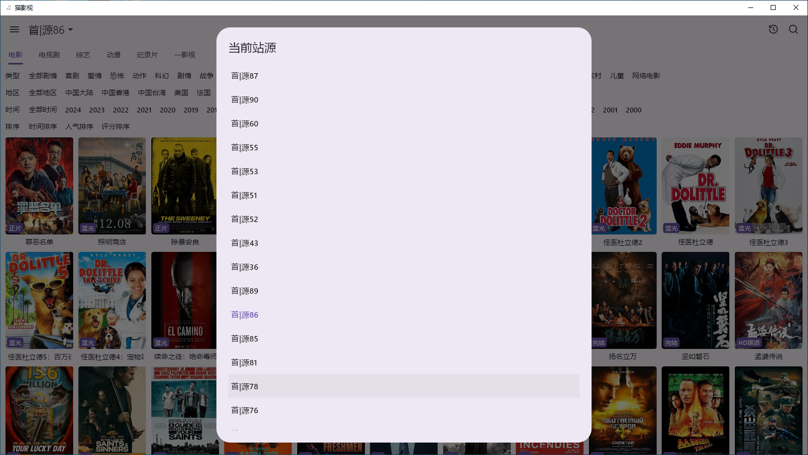

# 猫影视资源配置

所有内容均来自互联网分享站点所提供的公开引用资源，未提供资源上传、存储服务

一影视 TV APP 内置站点资源，已稳定运行一年多
 
 所有资源已适配 猫影视， 50+站点，定期维护

[猫影视官方下载](https://github.com/catvod/CatVodOpen/releases#assets) 支持 window,ios,android

[ios 爱思助手 自签教程](https://www.i4.cn/news_detail_38195.html)

[ios自签教程](https://omii.top/826.html)

# 资源

[TG 群](https://t.me/+uGeB94WVkgJlZjI1)

- 20+站点,提供资源压缩包下载，自行上传 [资源包下载](https://github.com/tv-player/cat/releases/tag/1.0.0)

- VIP服务：60+站点，提供单独部署，程序实时同步，资源稳定可靠，支持上传 github、坚果云、gitee,长久有效 [联系我](https://t.me/yyskkk_bot)
